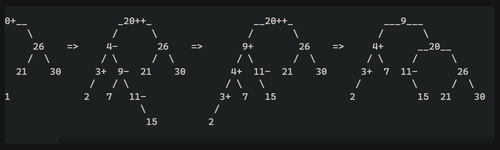
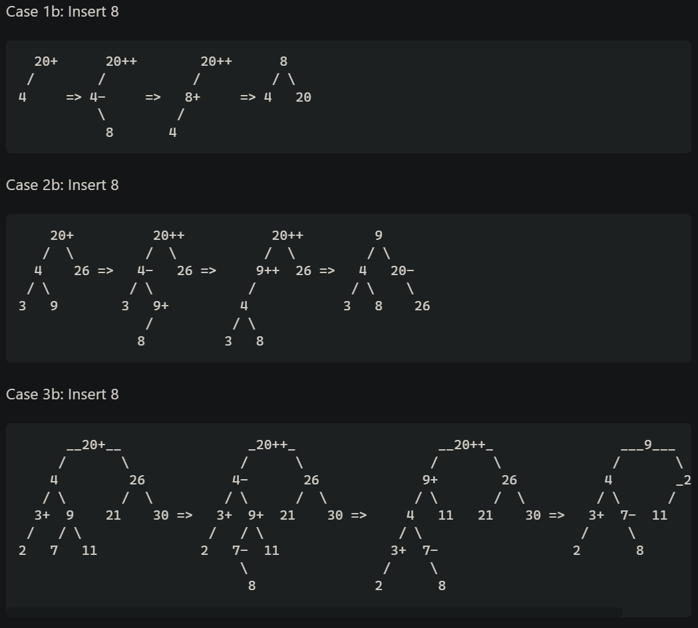
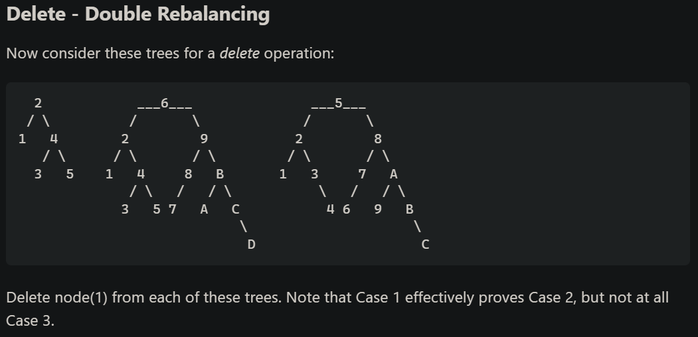
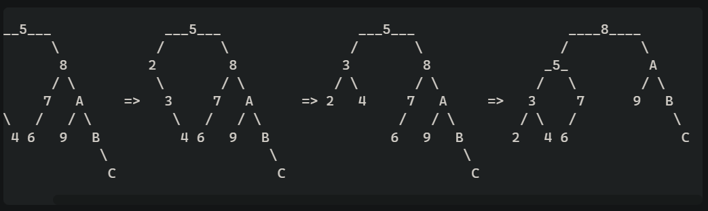

# AVL Search Tree

Aufgaben:

Zur Laufzeit soll möglich sein:
- [x] Benutzer-Eingabe von Werten
- [x] Elemente hinzufügen
- [x] Elemente finden
- [x] Elemente entfernen
- [x] Abfragen ob ein Element vorhanden ist
- [x] Der AVL Baum soll sich selber ausbalancieren und 
- [x] die maximale Tiefe ausgeben können.
- [x] Es soll möglich sein dem AVL Baum einen Delegaten zu übergeben, welcher die Bedingung für das Sortieren besitzt.
- [x] Zum Ende muss eine DLL-Datei erstellt werden. Diese DLL muss in einem anderen Projekt verwendet und dort an Hand von Beispiel-Code verwendet werden.

## Test Cases

*Source: https://stackoverflow.com/questions/3955680/how-to-check-if-my-avl-tree-implementation-is-correct*
